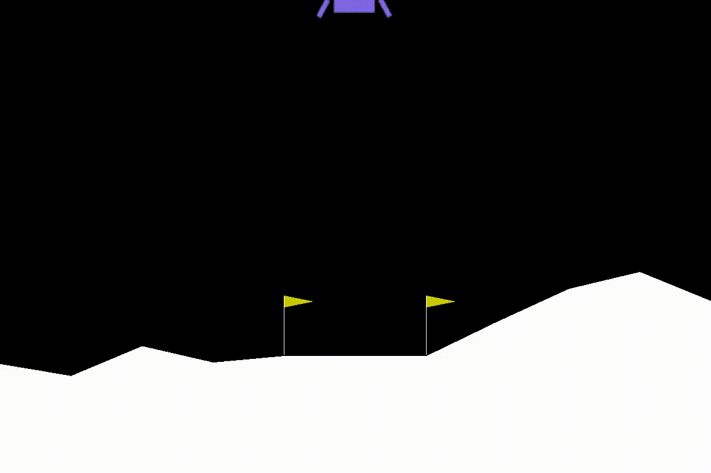

# Deepair is a Deep Reinforcement Learning library

[](https://badge.fury.io/py/deepair)
[](https://deepair.readthedocs.io/en/latest/?badge=latest)

Deepair implementations of reinforcement learning algorithms. It focus on DRL algorithms and implementing the latest advancements in DRL. Highly customizable support for training processes. Suitable for the research and application of the latest technologies in reinforcement learning.


# Features

# Documentation
Documentation is available: [https://deepair.readthedocs.io/](https://deepair.readthedocs.io/)

# Installation

```
pip install deepair
```

or
```
pip install git+https://github.com/sonnhfit/deepair.git
```

# Example

```python
import gym
from deepair.dqn import Rainbow

env = gym.make('LunarLander-v2')

rain = Rainbow(env=env, memory_size=10000, batch_size=32, target_update=256)

rain.train(timesteps=200000)

# test
state = env.reset()
done = False
score = 0

while not done:
    action = rain.select_action(state, deterministic=True)
    next_state, reward, done, info = env.step(action)

    state = next_state
    score += reward

print("score: ", score)
```



# Implemented Algorithms

# Tutorial
- save model 
- load model

# How To Contribute
